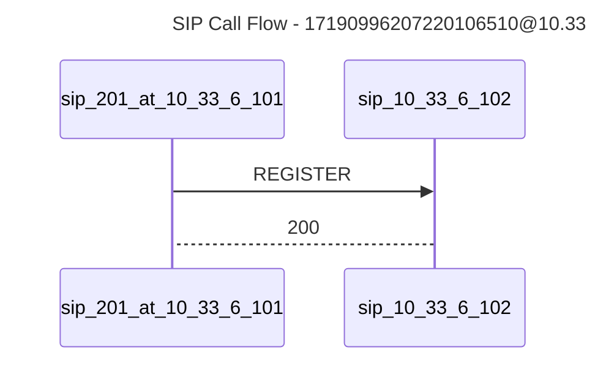

# SIP PCAP Analyzer

A command-line tool to analyze SIP (Session Initiation Protocol) traffic from PCAP files and generate Mermaid sequence diagrams of the call flows.

## Features

- Parse PCAP files containing SIP traffic
- Extract and analyze SIP messages (REGISTER, INVITE, BYE, etc.)
- Group messages by Call-ID
- Generate Mermaid sequence diagrams for call flows
- Filter packets by:
  - Call-ID
  - From/To addresses
  - Time range
- Debug mode for detailed packet analysis

## Installation

### Prerequisites

- Go 1.20 or later
- libpcap development files

On macOS:
```bash
brew install libpcap
```

On Ubuntu/Debian:
```bash
sudo apt-get install libpcap-dev
```

### Building from Source

1. Clone the repository:
```bash
git clone https://github.com/AndreHeber/bricks.git
cd bricks
```

2. Build the binary:
```bash
make build
```

Or install it directly:
```bash
make install
```

## Usage

Basic usage:
```bash
pcap-analyzer capture.pcap
```

With output file:
```bash
pcap-analyzer -o flow.md capture.pcap
```

### Command Line Options

- `-o <file>`: Write output to file instead of stdout
- `--call-id <id>`: Filter by SIP Call-ID
- `--from <addr>`: Filter by From address
- `--to <addr>`: Filter by To address
- `--start "YYYY-MM-DD HH:MM:SS"`: Filter packets after start time
- `--end "YYYY-MM-DD HH:MM:SS"`: Filter packets before end time
- `--debug`: Enable debug logging
- `--version`: Print version information
- `-v`: Print short version information

### Example Output

The tool generates Mermaid sequence diagrams that visualize the SIP message flow:



## Development

### Project Structure

```
.
├── cmd/
│   └── pcap-analyzer/     # Command-line interface
├── pkg/
│   ├── pcap/             # PCAP analysis and SIP packet handling
│   ├── sip/              # SIP message parsing
│   └── version/          # Version information
├── test/
│   ├── data/            # Test PCAP files
│   └── e2e/             # End-to-end tests
└── Makefile             # Build and development commands
```

### Running Tests

Run all tests:
```bash
make test
```

### Contributing

1. Fork the repository
2. Create your feature branch (`git checkout -b feature/amazing-feature`)
3. Commit your changes (`git commit -m 'feat: add amazing feature'`)
4. Push to the branch (`git push origin feature/amazing-feature`)
5. Open a Pull Request

## License

This project is licensed under the MIT License - see the LICENSE file for details.

## Acknowledgments

- [gopacket](https://github.com/google/gopacket) for PCAP file parsing
- [Mermaid](https://mermaid-js.github.io/) for sequence diagram generation 